# Unit 18 | Homework Assignment: Building the Blockchain

The blockchain domain is rapidly changing.  Even those in a highly technical role must stay abreast of what is happening in the digital finance landscape as many FinTech companies are using and creating tools and services that are powered by blockchain. As a FinTech professional in these changing times, it's important to not only be aware of the advancements happening within the FinTech blockchain space, but to also understand the process for developing your very own blockchain.

This homework will be a two-part series in which you will first create a case study on a Canadian FinTech blockchain company. Then, you wil develop your very own blockchain.

## Before You Begin

1. Create a new GitHub repo called `blockchain-homework`. Then, clone it to your computer.

2. In your local git repository, create a directory for both of the Blockchain activities. Use folder names that correspond to the activities: **Blockchain Case Study** and **POA Development Chain**.

3. Push the above changes to GitHub.

# 1) Blockchain Case Study

For this part one assignment, your task is to create a case study that analyzes how a Canadian FinTech blockchain company is using technology to solve a standing financial problem in Canada.

# ITM House

## Research the domain and company:

ITM House was found in 2007. ITM House provides many different services such as product development, Web&Mobile, DevOps, and Product Marketing using blockchain technology. 

What makes ITM House special? It has built its reputation on providing many companies and businesses to transform, innovate and compete in the current market. The company is a global company which provides a wide range of product developing and digital solutions that satisfy many different companies and businesses' expectations. From a small start-up companies to a large established companies, the company can provide the best services for everyone. That what makes ITM House unique.

## ITM House Services:

### Product Discovery - Executing techniques to find valuable problems and vet potential solutions
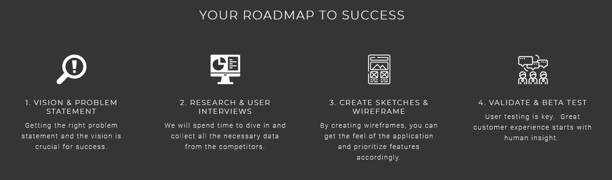

### Web & Mobile - Focus on a quality user experience and the little details
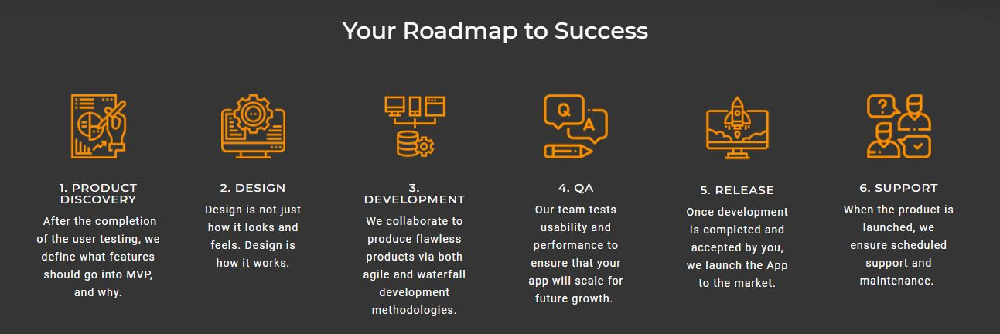

### DevOps - Experience to help customers of all sizes develop, deploy and manage their new or existing infrastructure in the cloud
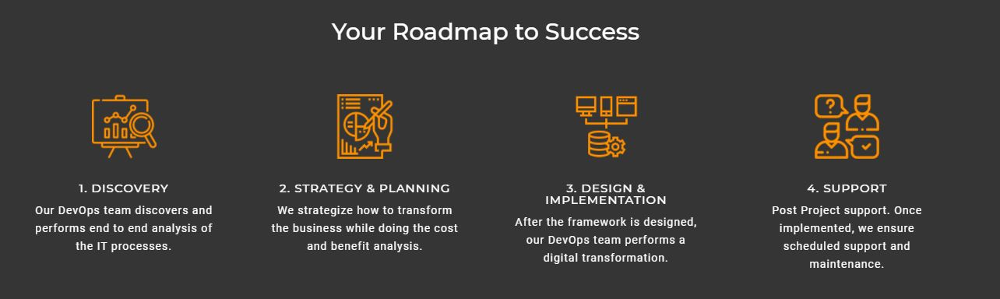

### Product Marketing - Specialize product strategy and usability, content marketing and social media marketing for technology companies

# Write a detailed case study of the company.

### Problem
A crypto mining platform that allows you to mine crypto on an industrial-scale without any equipment.

### Why is this important?
As you probably know, a crypto mining takes lots of effort. It uses lots of electricity, generating lots of heat, consuming more power, hard to install, and most importantly, it consumes lots of physical spaces. However, if you can mine crypto on an industrial-scale without any equipment, this will be a game changing project and itmhouse made this happen.

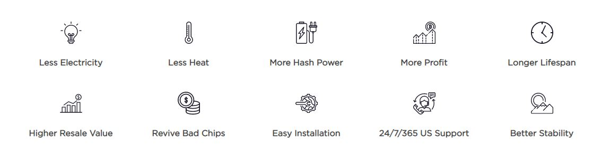

Using the technologies such as Hashrate Monitoring, Firmware Deployment, Heatmap Minitoring, Pool Switching, Power Monitoring, Remote Reoot, and Auto Updated features, the company can provide top class services to all their end users

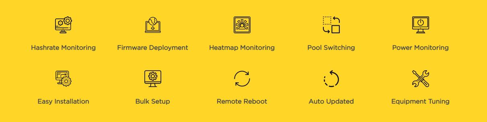

# Technology
Hashrate monitoring: Mining hashrate is a key security metric; more hashing/computing power in the network, the greater the security and its overall resistance to attack. Although Bitcoin’s exact hashing power is unknown, it is possible to estimate it from the number of blocks being mined and the current block difficulty.

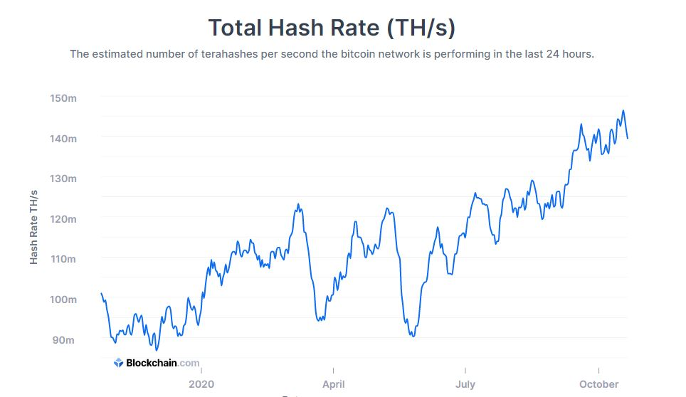

A heat map is a graphical representation of data where values are depicted by color. Heat maps are very useful to visualize complex data at a first glance

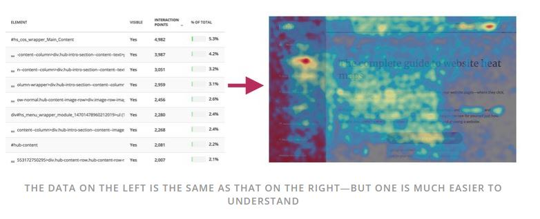

### Why this may be interesting?
ITM House developed for the customer mining platform with opportunity to profit from the growing cryptocurrency ecosystem. Now WATTUM is the most effortless way of receiving income from crypto, with mining centres that are specialized in mining using ASIC equipment and GPU. WATTUM uses hashing algorithms for Bitcoin mining and various altcoins such as Zcash, Siacoin, Decred, Ethereum and others. 

### Conclusion

ITM House work paid off. WATTUM's productivity growth went up by 7%, sales increase by 18%, user growth increases by 20% and 15% in cost savings and reduction. This is an amazing work provided by ITM House.

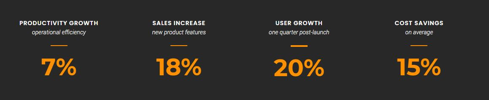

### Things to Keep in Mind for a Case Study

* Continuity of supply of top class services to the end users

* The financial impact of a more accessible private market and development of current services

* The regulatory concerns as well as compliance of WATTUM's services and future operations

* The worldwide impact in the market if WATTUM's services are one of the best in Canada

# Reference
- https://www.itmhouse.com/product-discovery/
- https://www.itmhouse.com/web-mobile/
- https://www.itmhouse.com/devops/
- https://www.itmhouse.com/product-marketing/
- https://www.itmhouse.com/case-studies/
- https://www.itmhouse.com/wattum/
- https://www.blockchain.com/charts/hash-rate
- https://www.hotjar.com/heatmaps/
# 2) For part two of this assignment, you will take on the role of a new developer at a small bank.

Your mission, should you choose to accept it, will be to set up a testnet blockchain for your organization.

To do this, you will create and submit four deliverables:

* Set up your custom testnet blockchain.

* Send a test transaction.

* Create a repository.

* Write instructions on how to use the chain for the rest of your team.

### Background

You have just landed a new job at ZBank, a small, innovative bank that is interested in exploring what
blockchain technology can do for them and their customers.

Your first project at the company is to set up a private testnet that you and your team of developers
can use to explore potentials for blockchain at ZBank.

You have decided on setting up a testnet because:

There is no real money involved, which will give your team of developers the freedom to experiment.

Testnets allows for offline development.

In order to set up a testnet, you will need to use the following skills/tools we learned in class:

* Puppeth, to generate your genesis block.

* Geth, a command-line tool, to create keys, initialize nodes, and connect the nodes together.

* The Clique Proof of Authority algorithm.

Tokens inherently have no value here, so we will provide pre-configured accounts and nodes for easy setup.

After creating the custom development chain, create documentation for others on how to start it using the pre-configured
nodes and accounts. You can name the network anything you want, have fun with it!

Be sure to include any preliminary setup information, such as installing dependencies and environment configuration.

### Instructions

#### Setup the custom out-of-the-box blockchain

* Create accounts for two (or more) nodes for the network with a separate `datadir` for each using `geth`.

### Explain the configuration of the network, such as it's blocktime, chain ID, account passwords, ports, etc.
- Network Name : ztestnet
- Blocktime: How many seconds should blocks take. Default is 15
- Chain ID: Required in Mycrypto app
- Account Passwords: Password required for node 1 and node 2 to start mining and communicating
- Ports: Sets the peer port

### Node1
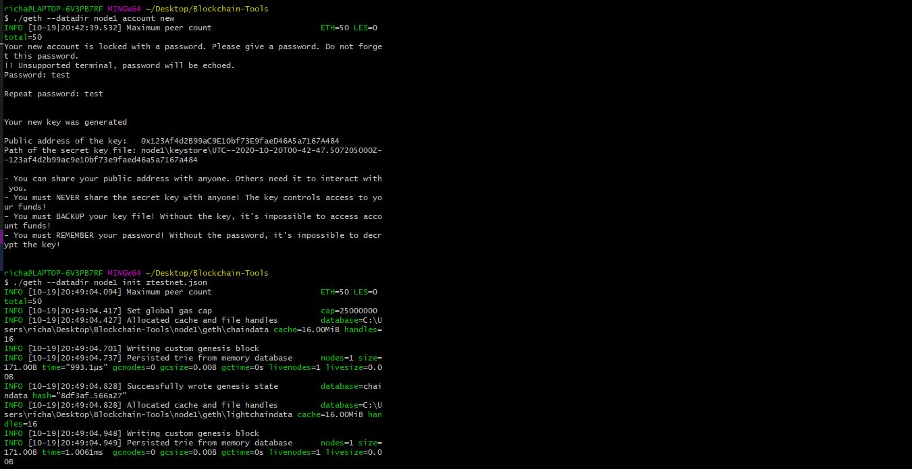

### Node2
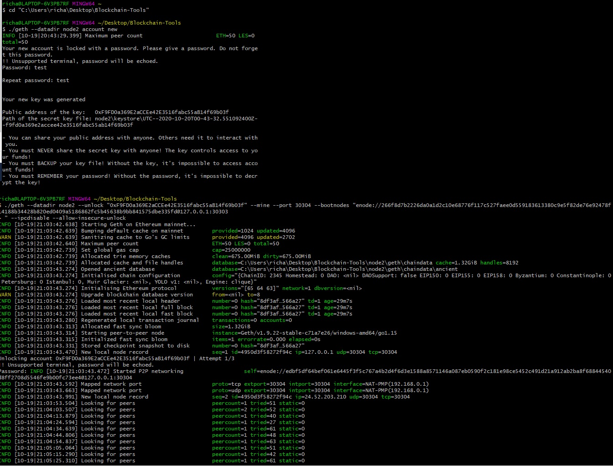

* Create a new project directory for your new network. Call it whatever you want!
* Run `puppeth`, name your network, and select the option to configure a new genesis block.
* Choose the `Clique (Proof of Authority)` consensus algorithm.
* Paste both account addresses from the first step one at a time into the list of accounts to seal.
* Paste them again in the list of accounts to pre-fund. There are no block rewards in PoA, so you'll need to pre-fund.
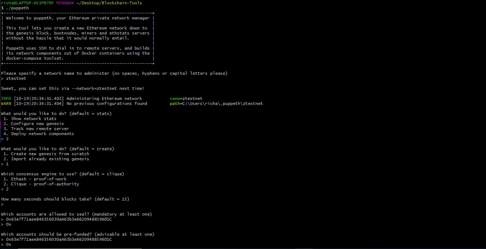

* You can choose `no` for pre-funding the pre-compiled accounts (0x1 .. 0xff) with wei. This keeps the genesis cleaner.
* Complete the rest of the prompts, and when you are back at the main menu, choose the "Manage existing genesis" option.
* Export genesis configurations. This will fail to create two of the files, but you only need `networkname.json`.
* You can delete the `networkname-harmony.json` file.
* Screenshot the `puppeth` configuration once complete and save it to the Screenshots folder.
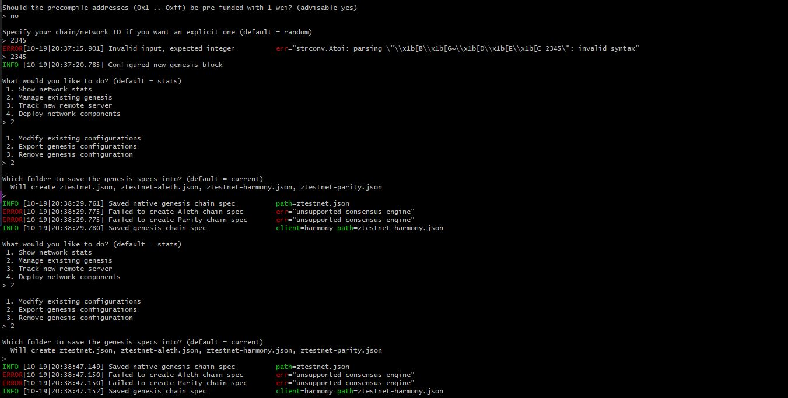

* Initialize each node with the new `networkname.json` with `geth`.
* Run the first node, unlock the account, enable mining, and the RPC flag. Only one node needs RPC enabled.
* Set a different peer port for the second node and use the first node's `enode` address as the `bootnode` flag.
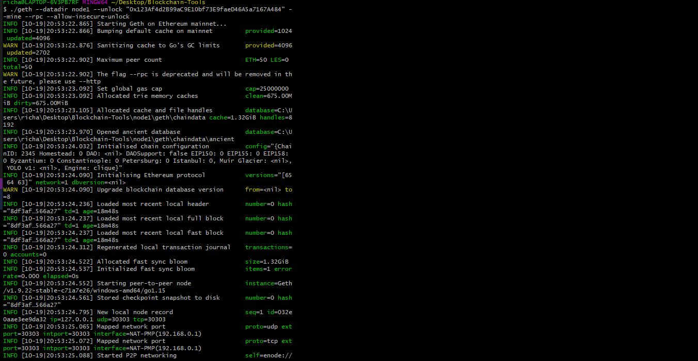

* Be sure to unlock the account and enable mining on the second node!
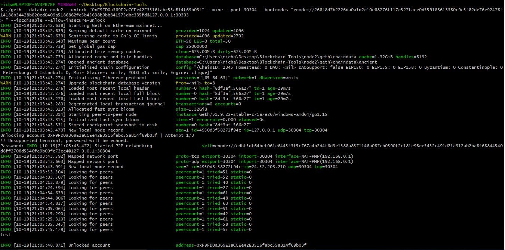

* You should now see both nodes producing new blocks, congratulations!

### Be sure to include all of the `geth` flags required to get both nodes to mine and explain what they mean.
- Networkid: Identifies the appropriate network provided a network id
- Password: Finds password in text file to allow unlock.
- Port: Sets the peer port.
- Bootnodes: Tells geth which node to connect to provided an enode address
- Rpc: Exposes a port on the node allowing commucation with the outside world
- Mine: Tells node to mine new blocks
- Minerthreads: Tells get how many CPU “workers” to use
- Unlock: Unlocks the account provided an address

#### Send a test transaction

* Use the MyCrypto GUI wallet to connect to the node with the exposed RPC port.

* You will need to use a custom network, and include the chain ID, and use ETH as the currency.

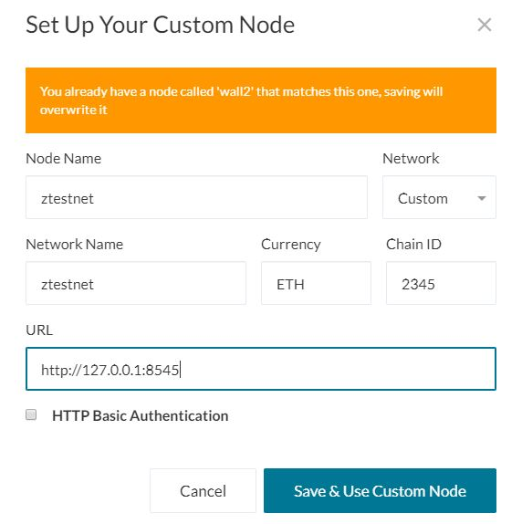

* Import the keystore file from the `node1/keystore` directory into MyCrypto. This will import the private key.

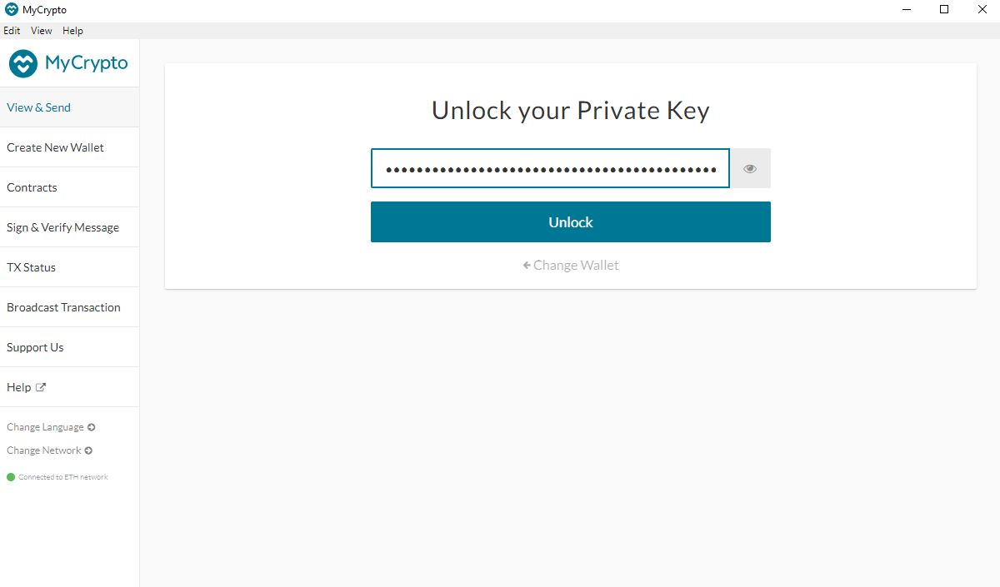

* Send a transaction from the `node1` account to the `node2` account.

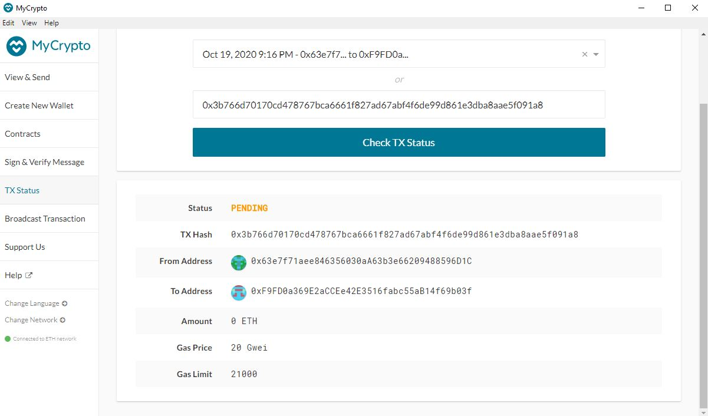

- Error message : "Block sealing failed" came up even after 3 tries. Due to this, the transaction is still pending.
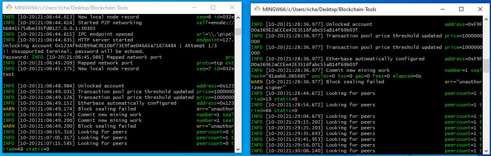

* Copy the transaction hash and paste it into the "TX Status" section of the app, or click "TX Status" in the popup.

* Screenshot the transaction metadata (status, tx hash, block number, etc) and save it to your Screenshots folder.
- Successful one should look like this below:

* Celebrate, you just created a blockchain and sent a transaction!

#### Create a repository, and instructions for launching the chain

* Create a `README.md` in your project directory and create documentation that explains how to start the network.

* Remember to include any environment setup instructions and dependencies.

* Be sure to include all of the `geth` flags required to get both nodes to mine and explain what they mean.

* Explain the configuration of the network, such as it's blocktime, chain ID, account passwords, ports, etc.

* Explain how to connect MyCrypto to your network and demonstrate (via screenshots and steps) and send a transaction.

* Upload the code, including the `networkname.json` and node folders.

#### Remember, *never* share your mainnet private keys! This is a testnet, so coins have no value here!

#### Hints

* If you get stuck - try our step by step PoA Guide located [here](Resources/POA-Blockchain-guide.md).

* If you aren't seeing any movement in the wallet amounts in MyCrypto after sending/receiving transactions, try the following:

    * Terminate both nodes using control+C in the Node1 and Node2 terminal windows.
    * Change networks in MyCrypto to a Testnet such as Kovan.
    * Restart Node1 and Node2 in their terminal windows.
    * Reconnect to your network in MyCrypto.
    * Log into your wallet and refresh the amount.

* If that doesn't help make sure you are sending a large enough sum of ETH to see actual movement in the digits. You may have to click on the amount itself to see the full value down to the WEI.
---
© 2020 Trilogy Education Services, a 2U, Inc. brand. All Rights Reserved.
